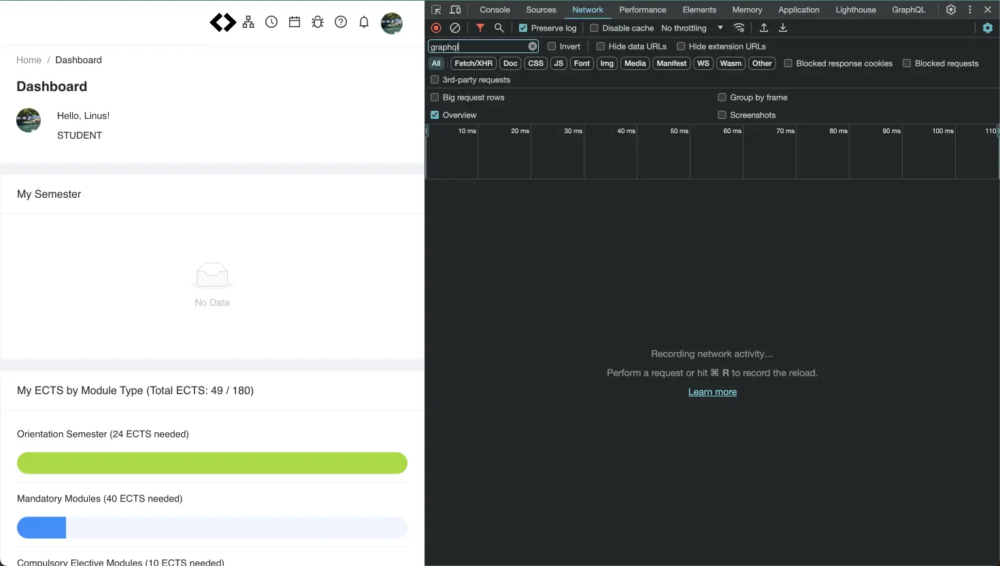
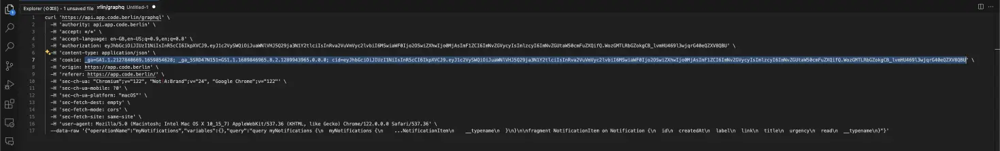

# code-university

Functionality and data related to CODE University of Applied Sciences (https://code.berlin), specifically the CODE Learning Platform (https://app.code.berlin).

## Tested with

[CODE Learning Platform](https://app.code.berlin) v2.13.3
NodeJs v20.5.1
NPM v9.8.0

## Install

Install the package:

```bash
npm install code-university
```

## Examples

```typescript
// basic usage
import { LearningPlatformClient } from 'code-university';

async function main() {
  const learningPlatform = await LearningPlatformClient.fromGoogleCookie(
    process.env.GOOGLE_COOKIE
  );
  const settings = await learningPlatform.getOwnSettings();

  console.log(settings);
}
main();
```

## Retrieving your cookie from the CODE Learning Platform

1. Open https://app.code.berlin
2. Open the network tab of the browser devtools using `Cmd + Shift + I` on mac or `Ctrl + Shift + I` on windows
3. In the network tab, filter by `graphql`
4. Reload the page to see new requests coming in
5. Right-click any of the requests are NOT of type `preflight`, hover over `Copy`, and click `Copy as cURL`
6. Paste the resulting string in a text editor of your choice and copy the cookie value




