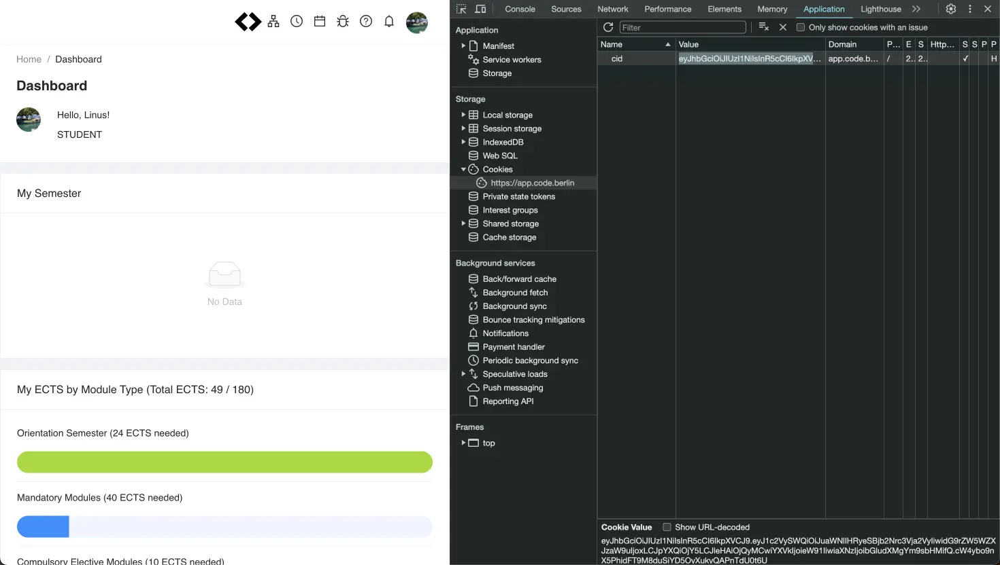

# code-university

Functionality and data related to CODE University of Applied Sciences (https://code.berlin), specifically the CODE Learning Platform (https://app.code.berlin).

## Tested with

- [CODE Learning Platform](https://app.code.berlin) v2.14.5
- NodeJs v20.5.1
- NPM v9.8.0

## Install

Install the package:

```bash
npm install code-university
```

## Examples

```typescript
// basic usage
import { LearningPlatformClient } from 'code-university';

async function main() {
  const learningPlatform = await LearningPlatformClient.fromRefreshToken(
    process.env.LEARNING_PLATFORM_REFRESH_TOKEN
  );
  const settings = await learningPlatform.getOwnSettings();

  console.log(settings);
}
main();
```

## Retrieving a refresh token from the CODE Learning Platform

1. Open https://app.code.berlin
2. Open the browser devtools using `Cmd + Shift + I` on mac or `Ctrl + Shift + I` on windows
3. Click on the `Application` tab
4. On the left side of the `Application` tab, click `Cookies` > `https://app.code.berlin`
5. Double-click the `Value` field of the `cid` cookie, and copy it to your clipboard.


